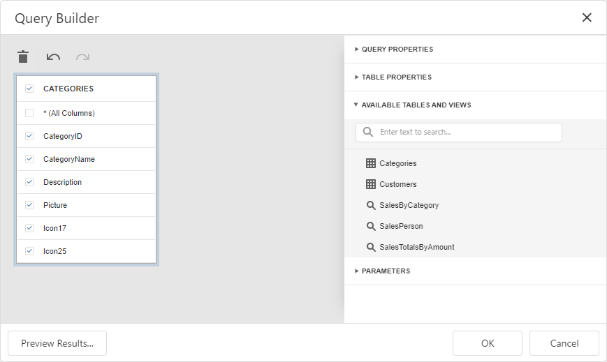
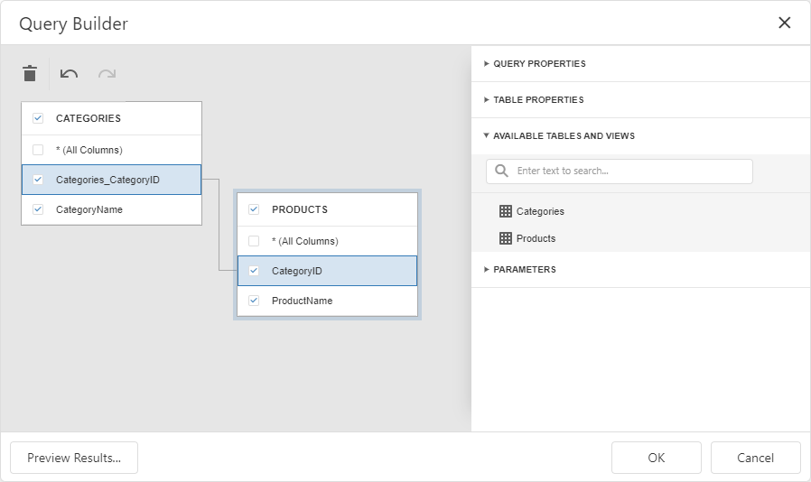

<!-- default badges list -->

<!-- default badges end -->
# Dashboard for ASP.NET Core - How to customize a database schema for SQL data sources

This example shows how to create a custom database schema for the dashboard. The example contains two implementation of the [IDBSchemaProviderEx](https://docs.devexpress.com/CoreLibraries/DevExpress.DataAccess.Sql.IDBSchemaProviderEx) interface, `LimitDBSchemaProvider` and `ManualDBSchemaProvider`. Call the [DashboardConfigurator.SetDBSchemaProvider](https://docs.devexpress.com/Dashboard/DevExpress.DashboardWeb.DashboardConfigurator.SetDBSchemaProvider(DevExpress.DataAccess.Sql.IDBSchemaProviderEx)) method to assign the database schema to the Web Dashboard.

To see the result, add a new query or edit the existing query.

### The LimitDBSchemaProvider class

File: [LimitDBSchemaProvider.cs](./CS/WebDashboardAspNetCore/LimitDBSchemaProvider.cs)

This provider displays only the following database entities:

- Tables which names start with the letter *C*
- Views which names start with *Sales*
- Stored procedures with zero arguments

### The ManualDBSchemaProvider class

File: [ManualDBSchemaProvider.cs](./CS/WebDashboardAspNetCore/ManualDBSchemaProvider.cs)

This provider loads two tables (`Categories` and `Products`) for the `NWindConnectionString` connection. Both tables contain only two columns and the tables are linked by the `CategoryID` field.

This technique improves the [Data Source Wizard](https://docs.devexpress.com/Dashboard/117680/) performance when loading the database schema.

## Files to Look At

* [LimitDBSchemaProvider.cs](./CS/WebDashboardAspNetCore/LimitDBSchemaProvider.cs)
* [ManualDBSchemaProvider.cs](./CS/WebDashboardAspNetCore/ManualDBSchemaProvider.cs)
* [DashboardUtils.cs](/CS/WebDashboardAspNetCore/Code/DashboardUtils.cs#L19)

## Documentation

* [IDBSchemaProviderEx](https://docs.devexpress.com/CoreLibraries/DevExpress.DataAccess.Sql.IDBSchemaProviderEx)

## More Examples

* [Dashboard for MVC - How to customize a data store schema for SQL data sources](https://github.com/DevExpress-Examples/aspnet-mvc-dashboard-how-to-customize-a-data-store-schema-for-sql-data-sources-t584271)
* [Dashboard for ASP.NET Core - How to implement multi-tenant Dashboard architecture](https://github.com/DevExpress-Examples/DashboardUserBasedAspNetCore#data-source-schema)
